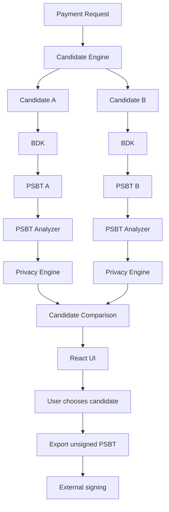

# VibeHack — Pre-Signing Bitcoin Privacy Planner

> **Don't just create a Bitcoin transaction. Compare it first.**

VibeHack is a pre-signing Bitcoin transaction planner that generates multiple valid transaction candidates for the same payment, analyzes their privacy-relevant trade-offs, and lets the user choose which PSBT to export and sign externally.

The key idea is simple:

**The transaction is not the only decision. Coin selection is a privacy decision too.**

---

## What VibeHack Does

A typical Bitcoin wallet selects UTXOs and builds a transaction.

VibeHack exposes that decision **before signing**.

```text
Wallet UTXOs
     ↓
Candidate Generator
     ↓
Candidate A / Candidate B / ...
     ↓
BDK transaction construction
     ↓
PSBT Analyzer
     ↓
Privacy Engine
     ↓
Candidate Comparison
     ↓
User chooses a candidate
     ↓
Export unsigned PSBT
     ↓
Sign externally
```

Instead of forcing the user to accept one transaction construction, VibeHack presents multiple valid alternatives and explains how their structure differs.

---

## Why This Matters

Bitcoin transactions reveal information through their structure.

For example, spending multiple inputs together may allow observers to apply the **common-input ownership heuristic**.

Choosing a particular UTXO also affects which coins remain available for future spending.

VibeHack makes these decisions visible **before the transaction is signed**.

The goal is not to produce a single "privacy score."

Instead, VibeHack generates valid alternatives and exposes their observable trade-offs so the user can make the final decision.

---

## Core Features

### 1. Multiple Transaction Candidates

VibeHack generates different UTXO selections for the same payment.

Current prototype strategies include:

- Two-UTXO selection
- Largest-first selection

The candidate engine is designed so additional privacy-oriented selection strategies can be added later.

---

### 2. Bitcoin Transaction Construction

Transactions are constructed using the **Bitcoin Development Kit (BDK)**.

BDK handles Bitcoin transaction and PSBT construction while VibeHack controls the candidate UTXO selection.

This keeps Bitcoin transaction correctness separate from the privacy-analysis layer.

---

### 3. PSBT Analysis

The PSBT analyzer extracts transaction-level facts including:

- transaction inputs
- input amounts
- outputs
- output amounts
- wallet-controlled outputs
- recipient amount
- transaction fee
- transaction size information

These structured facts are then passed to the privacy engine.

---

### 4. Privacy Analysis

The privacy engine analyzes privacy-relevant transaction properties such as:

- common-input ownership heuristic
- wallet-side cluster relationships
- likely change
- address reuse when sufficient metadata exists
- rare or important UTXO consumption
- future wallet optionality

The system is designed to distinguish between observable facts, heuristics, and incomplete metadata.

---

### 5. Side-by-Side Candidate Comparison

Candidates are compared using structured findings rather than an arbitrary universal privacy score.

The user can compare:

- number of inputs
- input amount
- fee
- change
- privacy observations
- future optionality
- important UTXO consumption

---

### 6. PSBT Export

After comparing candidates, the user can choose one and export its unsigned `.psbt` file.

**VibeHack does not sign or broadcast transactions.**

The exported PSBT can be taken to an external signing environment.

---

## Example

Suppose the user wants to send:

**3,500 sats**

VibeHack can construct different valid candidates for the same payment.

### Candidate A

```text
Inputs:       2
Input total:  4,591 sats
Fee:          213 sats
Change:       878 sats
```

Privacy observations:

```text
- 2 inputs
- Common-input ownership heuristic applies
- Single wallet-side metadata cluster
- Tagged reserve UTXO preserved
```

### Candidate B

```text
Inputs:       1
Input total:  142,653 sats
Fee:          155 sats
Change:       138,998 sats
```

Privacy observations:

```text
- 1 input
- Single-input construction
- Single wallet-side metadata cluster
- Tagged reserve UTXO consumed
```

These observations are heuristics and metadata-based findings, not absolute privacy guarantees.

The important point is that the user can see the trade-off **before signing**.

---

## Architecture



### Design Principle

VibeHack separates two responsibilities:

**Bitcoin correctness**

- UTXO selection
- transaction construction
- fee calculation
- PSBT generation

**Privacy semantics**

- common-input analysis
- cluster heuristics
- change analysis
- address reuse analysis
- future optionality

This separation makes the system easier to test and extend.

---

## Technology Stack

### Backend

- Python 3.13
- FastAPI
- Uvicorn
- BDK Python (`bdkpython`)
- SQLite

### Frontend

- React
- Vite
- JavaScript
- CSS
- Lucide React

### Bitcoin

- Bitcoin Development Kit (BDK)
- Signet for development and demonstration
- PSBT / BIP174 workflow

---

## Repository Structure

```text
VibeHack-Bitcoin/
│
├── backend/
│   ├── api.py
│   ├── planner.py
│   │
│   ├── bitcoin/
│   │   ├── psbt_analyzer.py
│   │   └── candidate_psbt_test.py
│   │
│   ├── candidate_engine/
│   │   └── selector.py
│   │
│   └── privacy_engine/
│       ├── models.py
│       ├── cluster.py
│       ├── change.py
│       ├── optionality.py
│       ├── analyzer.py
│       └── tests/
│
├── frontend/
│   └── src/
│       ├── App.jsx
│       └── App.css
│
├── .gitignore
├── LICENSE
└── README.md
```

---

## Running the Backend

### 1. Create a virtual environment

From the project root:

```powershell
python -m venv .venv
```

Activate it:

```powershell
.\.venv\Scripts\activate
```

---

### 2. Install backend dependencies

```powershell
pip install bdkpython fastapi uvicorn
```

---

### 3. Set the backend path

```powershell
$env:PYTHONPATH="$PWD\backend"
```

---

### 4. Start the API

```powershell
python -m uvicorn api:app --app-dir backend --reload --port 8000
```

The API will be available at:

```text
http://127.0.0.1:8000
```

Interactive API documentation:

```text
http://127.0.0.1:8000/docs
```

---

## Running the Frontend

Open another terminal in the project root.

```powershell
cd frontend
```

Install dependencies:

```powershell
npm install
```

Then start the development server:

```powershell
npm run dev
```

Frontend:

```text
http://localhost:5173
```

The frontend communicates with the FastAPI backend running on port `8000`.

---

## Bitcoin Network

VibeHack currently uses **Bitcoin Signet** for development and demonstration.

This allows the project to work with real Bitcoin transaction and PSBT structures without using mainnet funds.

The prototype uses a local watch-only wallet state and does not store private signing keys.

---

## API

### `GET /health`

Returns the service status.

Example response:

```json
{
  "status": "ok",
  "service": "vibehack-planner"
}
```

---

### `POST /plan`

Creates and compares transaction candidates for a requested payment.

Example request:

```json
{
  "destination": "tb1p...",
  "amount_sats": 3500,
  "fee_rate_sat_vb": 1
}
```

The response contains:

- candidate transaction analysis
- privacy findings
- future optionality findings
- candidate comparison
- unsigned PSBT data

---

## Privacy Model

### Common-Input Ownership Heuristic

Multiple inputs appearing in the same transaction may be interpreted by observers as belonging to the same entity.

VibeHack surfaces this as a heuristic.

It is **not proof of ownership**.

---

### Clusters

Clusters are currently represented using wallet-side metadata.

They should not be interpreted as objectively proven identities on the blockchain.

The purpose of cluster metadata in the prototype is to demonstrate how wallet knowledge can affect candidate comparison.

---

### Change

A wallet-controlled output receiving remaining value after payment and fee can be analyzed as a likely change output.

VibeHack avoids claiming certainty when the available information is insufficient.

---

### Address Reuse

Address reuse analysis requires address-history metadata.

When sufficient history is unavailable, VibeHack reports insufficient metadata rather than assuming that reuse did not occur.

---

### Future Optionality

A UTXO may be considered rare or important for future spending.

VibeHack can warn when a candidate consumes such a UTXO.

This allows the user to consider not only the current transaction but also the future state of the wallet.

---

## Why There Is No Universal Privacy Score

VibeHack intentionally avoids reducing all privacy considerations to a single number such as:

```text
Privacy = 87/100
```

Different candidates can have different trade-offs.

For example:

```text
Candidate A

+ preserves a tagged reserve coin
- uses multiple inputs
```

```text
Candidate B

+ uses a single input
- consumes the tagged reserve coin
```

There is no single number that can fully represent these trade-offs.

VibeHack exposes the underlying observations and leaves the decision to the user.

---

## Security / Signing Boundary

VibeHack is a **pre-signing planner**.

The prototype:

- constructs unsigned PSBTs
- analyzes transactions
- compares candidates
- exports PSBTs

The prototype does **not**:

- store private signing keys
- sign transactions
- broadcast transactions
- use Bitcoin mainnet funds

Development and demonstration use Signet.

The final signing step remains under the user's control through an external wallet or signing environment.

---

## Testing

The project includes automated tests covering:

- UTXO selection
- PSBT analysis
- input/output extraction
- fee calculation
- wallet ownership
- common-input heuristic
- cluster analysis
- change analysis
- address reuse handling
- future optionality
- candidate comparison

Run the test suite from the project root with:

```powershell
.\.venv\Scripts\python -m unittest discover -s backend -p "test_*.py" -v
```

---

## Development Notes

The project is intentionally designed around a clear separation between:

```text
Transaction Construction
        +
Privacy Analysis
        +
User Decision
```

AI or natural-language explanations can be added as an interpretation layer over the structured findings, but Bitcoin transaction correctness and privacy analysis remain deterministic components of the system.

This prevents an AI model from becoming the source of truth for transaction validity or cryptographic correctness.

---

## Current Prototype Limitations

The current prototype is intentionally focused on the core pre-signing workflow.

Current limitations include:

- a limited number of UTXO-selection strategies
- wallet-side metadata for cluster relationships
- limited address-history metadata
- Signet-based development environment
- no private-key signing
- no transaction broadcasting
- no universal privacy score

These limitations are deliberate parts of the current prototype scope rather than hidden assumptions.

---

## Demo Flow

```text
1. Enter destination and amount

2. Click "Plan Transaction"

3. VibeHack generates multiple valid candidates

4. Compare:
   - inputs
   - fees
   - change
   - privacy observations
   - future optionality

5. Choose a candidate

6. Export its unsigned PSBT

7. Sign externally
```

### Core Message

> **Same payment. Different transaction construction. Different trade-offs.**

---

## Project Status

### Completed

- [x] BDK wallet integration
- [x] Signet wallet synchronization
- [x] Real UTXO discovery
- [x] Multiple candidate selection
- [x] PSBT generation
- [x] PSBT analysis
- [x] Privacy engine
- [x] Candidate comparison
- [x] FastAPI backend
- [x] React frontend
- [x] PSBT export
- [x] Automated privacy-engine testing

### Next

- [ ] Final UI polish
- [ ] External destination demo
- [ ] Improved metadata import
- [ ] Final documentation
- [ ] Demo recording

---

## Team

### VibeHack

**Member 1 — Sarthak Agiwale**

- Bitcoin / BDK integration
- UTXO selection
- transaction construction
- PSBT generation
- PSBT analysis
- API integration
- frontend

**Member 2 — Gauri Bhosale**

- privacy analysis
- cluster heuristics
- change analysis
- address reuse analysis
- future optionality
- candidate comparison
- privacy-engine testing

---

## Open Source

VibeHack is released as open-source software under the **MIT License**.

Contributions, experiments, and extensions are welcome.

See [`LICENSE`](LICENSE) for the full license text.

---

## Final Product Idea

Most transaction tools focus on what happened **after** a Bitcoin transaction exists.

VibeHack focuses on the decision **before signing**.

```text
Traditional flow:

Choose transaction
       ↓
Sign
       ↓
Broadcast
       ↓
Analyze


VibeHack flow:

Payment request
       ↓
Generate candidates
       ↓
Analyze trade-offs
       ↓
Compare
       ↓
Choose
       ↓
Export PSBT
       ↓
Sign externally
```

**VibeHack turns coin selection from a hidden wallet operation into a visible user decision.**